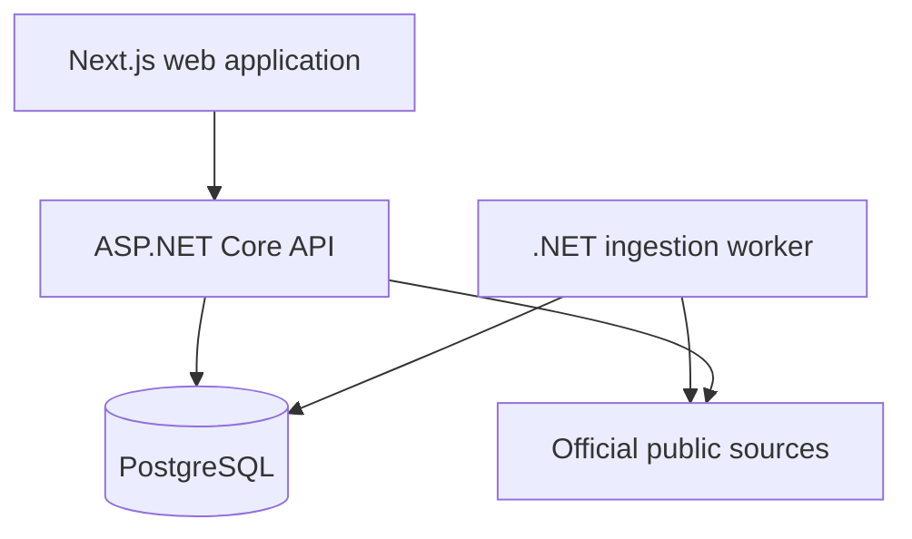

# TenderScope

<p align="center">
  <strong>Open procurement intelligence for teams that need evidence, not noise.</strong>
</p>

<p align="center">
  <a href="https://github.com/Dpehect/tenderscope-platform/actions/workflows/ci.yml"></a>
  
  
  
  
</p>

TenderScope is a full-stack procurement intelligence platform that discovers public tenders, converts fragmented source data into a consistent model, and helps bid teams qualify the opportunities that deserve attention.

It combines transparent open-data ingestion with search, analytics, organization workspaces, watchlists, notifications, operational controls, and a traceable decision pipeline. Every indexed opportunity retains its official source URL, keeping discovery useful without replacing the legal notice.

> **Project status:** feature-complete portfolio beta with a production-oriented architecture, automated quality gates, and real public-source adapters.

## The problem

Public procurement information is valuable but operationally difficult to use. Notices are distributed across institutional portals, described with inconsistent fields, published in different formats, and frequently buried behind poor search experiences.

TenderScope turns that fragmented landscape into a structured workflow:

- discover opportunities from official public systems;
- normalize markets, buyers, dates, categories, currencies, and values;
- identify duplicates through source identity and content fingerprints;
- evaluate opportunities with market context and tender intelligence;
- move qualified records through an organization-specific pipeline;
- monitor saved searches and notify teams when relevant notices appear.

## Product experience

### Opportunity discovery

- Full-text tender and buyer search
- Country, category, deadline, and value filters
- Multiple sorting strategies with paginated results
- Source-linked opportunity detail pages
- Market and category analytics
- Global search across normalized records

### Team qualification

- Multi-organization user accounts
- Role-based membership and invitations
- Tenant-isolated workspaces
- Qualification stages, notes, tags, owners, and due dates
- Saved watchlists with configurable matching rules
- In-app notifications and deadline reminders
- Organization-level analytics and settings

### Procurement intelligence

- Structured decision context for each opportunity
- Match scoring with explainable reasons
- Official-source provenance
- Disclosed-value and market distribution analysis
- Source health, crawl history, and parser metadata
- Administrative reporting and operational visibility

### Platform operations

- Scheduled ingestion and maintenance workers
- Exponential source failure backoff
- Retry and dead-letter processing
- Advisory locks for duplicate-job prevention
- Audit trails for privileged activity
- Liveness, readiness, and operational metrics endpoints
- CSV, Excel-compatible, and PDF report exports

## Data sources

TenderScope currently integrates:

| Source | Coverage | Adapter |
| --- | --- | --- |
| European Union Tenders Electronic Daily | EU procurement notices | TED Search API |
| World Bank Procurement Notices | International development procurement | World Bank public search |
| Deterministic validation source | Repeatable quality and smoke testing | Internal test adapter |

Source adapters are provider-neutral implementations of a shared ingestion contract. Additional jurisdictions can be introduced without coupling the procurement domain to a single portal or paid API.

## System architecture



TenderScope is implemented as a modular monolith with a separately deployable web client and background worker. This keeps domain boundaries explicit while avoiding unnecessary distributed-system complexity.

| Layer | Technology | Responsibility |
| --- | --- | --- |
| Web | Next.js 16, React 19, TypeScript | Discovery, analytics, authentication, and workspaces |
| API | ASP.NET Core 9 Minimal APIs | Identity, tenancy, queries, intelligence, and operations |
| Worker | .NET Worker Service | Scheduled source ingestion and normalization |
| Domain | C# domain model | Procurement, identity, organization, and workflow rules |
| Infrastructure | EF Core and resilient HTTP clients | Persistence, source adapters, parsing, and crawling |
| Data | PostgreSQL 16 | Transactional, tenant, tender, and operational records |
| Delivery | Docker and GitHub Actions | Reproducible builds and automated release gates |

### Backend boundaries

- **Domain** owns entities, invariants, and state transitions.
- **Application** defines repositories, parsers, source contracts, and result models.
- **Infrastructure** implements PostgreSQL persistence, crawling, normalization, and public-source adapters.
- **API modules** expose focused identity, organization, workspace, watchlist, notification, intelligence, security, and administration endpoints.
- **Worker services** coordinate ingestion, matching, maintenance, and operational jobs.

## Data lifecycle

1. A source becomes eligible according to its crawl interval and health state.
2. Its adapter retrieves openly accessible official records.
3. Raw fields are mapped into TenderScope's canonical tender model.
4. Source identifiers and content fingerprints prevent duplicate records.
5. Observation timestamps and source-quality metrics are updated.
6. Failed records enter controlled retry and dead-letter workflows.
7. Search and analytics expose normalized records while preserving official provenance.

## Security model

TenderScope treats tenant isolation and identity as core domain concerns.

- PBKDF2-SHA256 password hashing
- Short-lived JWT access tokens
- Hashed, rotating refresh-token families
- Refresh-token reuse detection and family revocation
- Organization-scoped authorization
- Owner, Admin, Manager, Analyst, and Viewer roles
- Account lockout with progressive backoff
- Authentication-specific and global rate limiting
- Explicit CORS and security-header policies
- Constant-time administrative key comparison
- Audit logging for privileged operations
- Production configuration validation
- PostgreSQL tenant-isolation integration coverage

## Reliability and quality

The continuous integration pipeline verifies both application layers and the production container path.

- NuGet vulnerability inspection
- Release-mode .NET builds
- Domain, security, crawler, and PostgreSQL integration tests
- Cross-tenant access isolation tests
- Running API smoke validation
- Frontend dependency security audit
- Strict TypeScript validation
- Next.js production build
- Non-root API container build
- Reproducible npm installs through a committed lockfile

## Repository map

```text
apps/
├── api/                         ASP.NET Core API and endpoint modules
├── web/                         Next.js application
└── worker/                      scheduled ingestion worker

src/
├── TenderScope.Domain/          entities and domain rules
├── TenderScope.Application/     contracts and application models
└── TenderScope.Infrastructure/  persistence, normalization, and sources

tests/
├── TenderScope.Domain.Tests/    focused domain and security tests
└── TenderScope.Tests/           API, crawler, and PostgreSQL integration tests

docs/                             architecture and release documentation
```

## Engineering documentation

- [Architecture](docs/ARCHITECTURE.md)
- [Delivery status](docs/PHASES.md)
- [Production release checklist](docs/PRODUCTION_RELEASE_CHECKLIST.md)
- [Crawler policy](src/TenderScope.Infrastructure/Crawling/README.md)
- [UI direction](docs/ui-direction.md)

## Responsible data use

TenderScope is designed for transparent discovery of openly accessible procurement information. It does not bypass authentication, access controls, or paid data services. New source adapters must respect source terms, robots directives, reasonable crawl intervals, and applicable law.

The linked official notice is always the final authority for eligibility, deadlines, required documents, and submission rules.

## Roadmap

- Jurisdiction-specific source adapters selected through legal and data-quality review
- Organization-configurable email delivery and digest scheduling
- Saved analytical views and bid-conversion reporting
- Browser-level end-to-end coverage for the complete qualification journey
- OpenTelemetry export and production alert routing
- Human-reviewed source quality dashboards

## Author

Designed and developed by **Yunus Emre Gürlek**  
GitHub: [@Dpehect](https://github.com/Dpehect)

## License

No open-source license has been granted. All rights are reserved.
