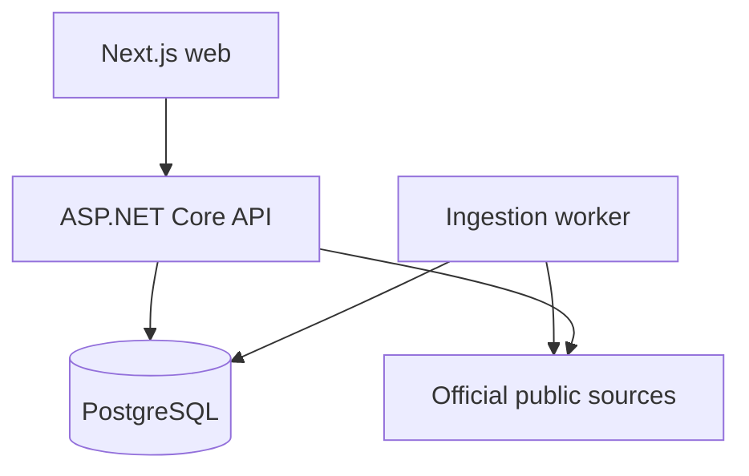

# Architecture

TenderScope is a modular monolith with a separately deployable ingestion worker and web client. This keeps transactional boundaries and operational ownership clear without introducing premature distributed-system complexity.

## Runtime topology

## Backend boundaries

- `TenderScope.Domain` owns entities, invariants and value transitions.
- `TenderScope.Application` defines repository, parser and source contracts.
- `TenderScope.Infrastructure` implements EF Core persistence, normalization, crawling and provider adapters.
- `apps/api` composes HTTP modules, authorization, production hardening and operational workers.
- `apps/worker` provides a dedicated scheduled-ingestion process for deployments that separate HTTP and background workloads.

## Data lifecycle

1. A scheduled source is claimed according to its interval and failure state.
2. The adapter retrieves only openly accessible official records.
3. Raw values are mapped to the canonical tender model.
4. Source ID and content fingerprint checks prevent duplicate records.
5. The observation timestamp and source-health state are updated.
6. Failed records enter retry/dead-letter operations without blocking healthy sources.
7. Public queries return normalized records with the official source URL intact.

## Tenancy and authorization

Users may belong to multiple organizations. Access tokens include the active organization and role; repository operations use that context to isolate workspace data. Refresh tokens are hashed at rest, rotated on use and grouped into revocable families. High-impact administration is restricted to Admin or Owner roles and recorded in the audit trail.

## Availability and operations

- `/health/live` reports process liveness without external dependencies.
- `/health/ready` verifies database readiness.
- ingestion and maintenance work use PostgreSQL advisory locks to prevent duplicate execution.
- operational metrics, job history, source quality and dead-letter state are exposed only through authorized endpoints.
- API rate limits are partitioned by client address, with stricter authentication limits.

## Deployment model

Docker Compose supplies the reproducible local topology. Production should deploy immutable API, worker and web images against managed PostgreSQL, external secret management, HTTPS termination and centralized telemetry. Schema changes are recorded through the production migration ledger and must pass the release checklist before promotion.
